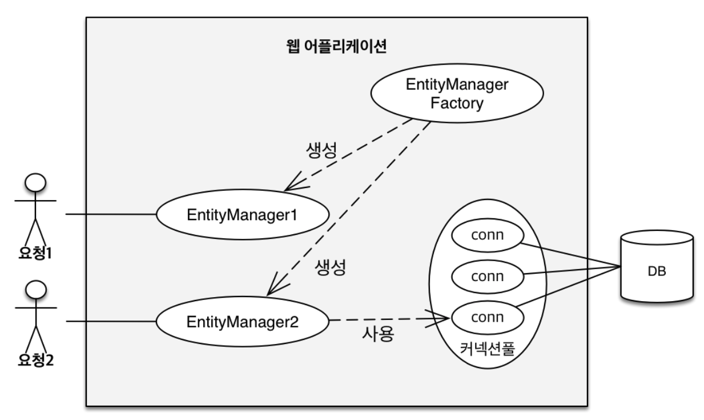
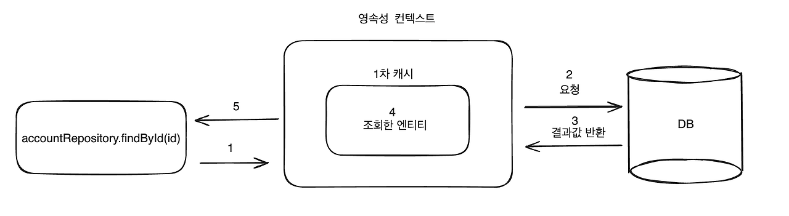

# Spring JPA
- Spring JPA 학습을 위한 샘플 코드 레포지토리

## 학습목표
- Spring JPA에 대해서 이해하고 RDB와 JAVA Object간에 관계 및 맵핑에 대해서 학습

## Spring JPA란?
- JPA는 Java Persistence API의 줄임말이다.
Java 진영에서 ORM(Object-Relational Mapping) 기술 표준으로 사용하는 인터페이스 모음
자바 어플리케이션에서 관계형 데이터베이스를 사용하는 방식을 정의한 인터페이스
인터페이스 이기 때문에 Hibernate, OpenJPA 등이 JPA를 구현함

  [출처 : https://dbjh.tistory.com/77]  


## ORM이란?
- 우리가 일반 적으로 알고 있는 애플리케이션 Class와 RDB(Relational DataBase)의 테이블을 매핑(연결)한다는 뜻이며, 기술적으로는 어플리케이션의 객체를 RDB 테이블에 자동으로 영속화 해주는 것이라고 보면된다.  
  
  장점
    * SQL문이 아닌 Method를 통해 DB를 조작할 수 있어, 개발자는 객체 모델을 이용하여 비즈니스 로직을 구성하는데만 집중할 수 있음.
(내부적으로는 쿼리를 생성하여 DB를 조작함. 하지만 개발자가 이를 신경 쓰지 않아도됨)
    
    * Query와 같이 필요한 선언문, 할당 등의 부수적인 코드가 줄어들어, 각종 객체에 대한 코드를 별도로 작성하여 코드의 가독성을 높임

    * 객체지향적인 코드 작성이 가능하다. 오직 객체지향적 접근만 고려하면 되기때문에 생산성 증가
    
    * 매핑하는 정보가 Class로 명시 되었기 때문에 ERD를 보는 의존도를 낮출 수 있고 유지보수 및 리팩토링에 유리

    * 예를들어 기존 방식에서 MySQL 데이터베이스를 사용하다가 PostgreSQL로 변환한다고 가정해보면, 새로 쿼리를 짜야하는 경우가 생김. 이런 경우에 ORM을 사용한다면 쿼리를 수정할 필요가 없음  
  
  단점
    * 프로젝트의 규모가 크고 복잡하여 설계가 잘못된 경우, 속도 저하 및 일관성을 무너뜨리는 문제점이 생길 수 있음

    * 복잡하고 무거운 Query는 속도를 위해 별도의 튜닝이 필요하기 때문에 결국 SQL문을 써야할 수도 있음
    
    * 학습비용이 비쌈

## JPA를 사용하는 이유?
- JPA를 사용하여 얻을 수 있는 가장 큰 것은 `SQL아닌 객체 중심`으로 개발할 수 있다는 것이다. 이에 따라 당연히 생산성이 좋아지고 유지보수도 수월하다.  
  
  `또한 JPA는 패러다임의 불일치도해결하였다. 예를 들면 JAVA에서는 부모클래스와 자식클래스의 관계 즉, 상속관계가 존재하는데 데이터베이스에서는 이러한 객체의 상속관계를 지원하지 않는다.`  
  
  이런 상속관계를 JPA는 아래와 같은 방식으로 해결하였다.  
  
  [출처 : https://dbjh.tistory.com/77]  
  

## Spring JPA 구조 및 동작 과정
- [출처 : https://velog.io/@jkijki12/JPA-%EC%95%95%EC%B6%95-%EA%B3%B5%EB%B6%80]  
  

1. 요청이 들어온다.

2. EnitityManager Factory에서 EntityManager를 생성한다.

3. EntityManager는 요청에서 DB가 필요하다면, DB 커넥션 풀에서 커넥션을 1개 사용한다.

4. WAS는 EntityManager를 이용하여 DB 조회와 다른 필요한 작업을 수행하고 요청에 응답한다.

    EntityManager가 DB와 소통을 하면서 "영속성 컨텍스트"라는 개념을 사용한다.  

## Persistance & Life Cycle & JPA 캐시
- JPA를 이용해본 사람이라면 누구나 "영속성 컨텍스트"에 대해서 들어보았을 것이다. 단어를 하나씩 뜯어보자.

    ```
    영속성?
    컴퓨터 공학에서 영속성은 프로세스가 생성했지만 별개로 유지되는 상태의 특징 중 한 가지이며, 별도의 기억 장치에 데이터를 보존하는 것을 목적으로 한다. 이 특징으로 인해 프로그래머는 저장 장치로부터 데이터를 전송하는 작업 및 자료 구조 등을 이용해 데이터를 보존하는 것이 가능하다.
    ```

    ```
    컨텍스트?
    누가 무엇을 어떤 의도를 가지고 언제 행위를 하였는지에 대한 정보를 통칭한다.
    한마디로, 런타임 시 생성되는 정보이다.
    ```

    ```
    영속성 컨텍스트는 런타임 시 JPA와 함께 사용되는 개발자의 의도에 대한 별도의 기억장치에 보존되어 있는 정보이다.
    ```

- Life Cycle(생명주기)    

    영속성 컨텍스트는 생명 주기를 가지고 있다. 생명 주기는 비영속, 영속, 준영속, 삭제 상태로 4개가 존재한다.    
  
  1. 비영속(new) : 영속성 컨텍스트와 상관없는 상태  
  2. 영속(managed) : 영속성 컨텍스트에 저장되어 관리되고 있는 상태  
  3. 준영속(detached) : 영속성 컨텍스트에서 분리된 상태  
  4. 삭제(removed) : 삭제 상태  
  
  [출처 : https://velog.io/@jkijki12/JPA-%EC%95%95%EC%B6%95-%EA%B3%B5%EB%B6%80]  
  

- JPA 캐시  
JPA에도 캐시가 존재한다. 데이터베이스에 접근하는 시간 비용을 줄이기 위하여 조회한 데이터를 메모리에 캐싱해둔다.
JPA 캐시는 1차 캐시 & 2차 캐시로 나뉜다.  
  
  * 1차 캐시  
  [출처 : https://velog.io/@jkijki12/JPA-%EC%95%95%EC%B6%95-%EA%B3%B5%EB%B6%80]  
  
    * 하나의 트랜잭션이 시작되고 종료될 때 까지만 1차 캐시내에 데이터가 유효하다.

    1차 캐시에 조회하려는 값이 존재하지 않을 경우  
    [출처 : https://hoestory.tistory.com/69]  
      
    
    1차 캐시에 조회하려는 값이 존재하는 경우  
    [출처 : https://hoestory.tistory.com/69]  
      
  
  * 2차 캐시  
  [참조 : https://github.com/Developer-Choi-Jae-Young/CacheTest]  
  [출처 : https://velog.io/@jkijki12/JPA-%EC%95%95%EC%B6%95-%EA%B3%B5%EB%B6%80]  
  
    * 2차 캐시는 동시성을 위하여 캐시를 직접 반환하지 않고 복사본을 반환한다.  
    * 복사본을 만드는 이유는 캐시를 한 객체에서 그대로 반환해버리면 여러 곳에서 같은 객체를 동시에 수정하는 동시성 문제가 발생할 수 있다.  
    * 1차 캐시와는 달리, 어플리케이션 전체적으로 사용되는 캐시이다.

## 쓰기지연
  [출처 : https://velog.io/@jkijki12/JPA-%EC%95%95%EC%B6%95-%EA%B3%B5%EB%B6%80]  
  
```
	@Test
	void Test() {
		EntityManagerFactory emf = Persistence.createEntityManagerFactory("hello");
		EntityManager em = emf.createEntityManager();
		EntityTransaction tx = em.getTransaction();
		tx.begin();

		try {
			MemberTest memberTest = new MemberTest();
			memberTest.setId(1L);
			memberTest.setName("HelloA");
			em.persist(memberTest);
		} catch (Exception e) {
			tx.rollback();
		} finally {
			em.close();
		}
		emf.close();
	}
```
위 처럼 코드가 있다고 생각해보자. 이렇게 될 경우에는 Query문이 정상적으로 실행이 되지 않는다.    
이유는 쓰기 지연 SQL 저장소가 존재한다. 위와 같이 em.persist 코드가 실행되면 JPA는 해당하는 SQL을 저장소에 저장만 해두기 때문이다. 만약 실제로 DB에 쿼리문 반영을 위해선 flush를 통해 실행을 해야된다.

## 객체 / 테이블 두 관계간 맵핑
- 단방향  
    ```
    class A{

        B b;

    }

    Class B{
        A a;
        
    }
    ```
    JAVA 객체와 DB 테이블 간의 괴리감을 없애기 위하여 생긴 개념이다.  
    위의 예시와 같이, A객체에서 B객체로만 접근이 가능하도록 하는 경우를 "단방향 매핑"이라고 한다.
- 양방향  
    ```
    class Team{
        @OneToMany(mappedBy = "team")
        private List<User> users = new ArrayList<User>();
    }

    class User{
        @ManyToOne
        private Team team;
    }
    ```
    - Team은 "mappedBy"속성을 가지고 있으므로 연관관계 주인이 아니다.  
    - Team은 단순히 user객체를 조회만 할 수 있다.  
    - User은 연관관계의 주인이다.

    - 연관관계 주인 규칙  
        1. 연관관계 주인만이 외래키를 관리할 수 있다.  
        2. 주인이 아닌 쪽은 읽기만 할 수 있다.  
        3. 보통 일대다 관계에서 "일"이 연관관계 주인이 된다.

    위의 코드로 예시를 들면, Team에서는 user에 대한 정보를 수정할 수 없다.
    (team 객체에서 user.remove(user)를 수행하면 user가 실제 DB객체에 적용되지 않는다.)

    **@JoinColumn**  
    외래키를 매핑할 때, 어떠한 키를 외래키로 지정해줄 수 있다.  
    생략이 가능하며, 생략할 경우 @Id값이 자동으로 외래키로 지정된다.
- M : N 매핑  
매핑에도 종류가 4가지가 있다.  
    1. 일대일 : 두 객체의 관계가 1:1의 관계, 지원 어노테이션(@OneToOne)  
    2. 일대다 : 두 객체의 관계가 1:N의 관계(@OneToMany)  
    3. 다대일 : 두 객체의 관계가 N:1의 관계(@ManyToOne)  
    4. 다대다 : 두 객체의 관계가 N:N의 관계(@ManyToMany)  
    
    - 일대다 & 다대일 매핑(양방향)  

        ```
        //Team ↔ Users 관계

        class Team{
            @OneToMany(mappedBy = "team")
            List<User> users = new ArrayList<>();
        }

        class User{
            @ManyToOne(mappedBy = "user)
            Team team;
        }
        ```

        Team : team 입장에서는 team 1개에 N개의 User가 등록된다.(@OneToMany)  
        User : user 입장에서는 user N개가 1개의 Team에 등록된다. (
        @ManyToOne)

    - 다대다 매핑  
    이 경우를 지원해주는 어노테이션은 "@ManyToMany"가 된다. 하지만, 다대다로 매핑할 경우 상당히 비즈니스 로직을 작성하는데 어려움을 겪는다. 그래서 관계 테이블을 생성하는 편법을 사용한다.  

    - 관계 테이블 생성  
    관계 테이블이란 비즈니스적으로는 필요없지만 기술적으로는 필요한 테이블을 말한다.  
    Team과 User사이에 TeamUser테이블을 1개 더 생성한다. 그래서  
    Team (N) ↔ (1) TeamUser (1) ↔ (N) User 와 같이 매핑을 한다.